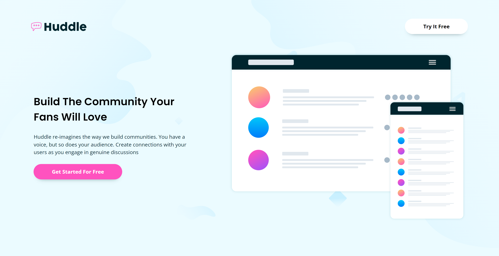

<h1 align="center">Octanet Internship</h1>

## Task 1 - Landing page

* ### Thumbnail
    

* ### Tools
  
    1. HTML
    2. CSS

* ### About the page

    *__Huddle__, a platform to create a community with your fans*.

    This page serves as the landing page for Huddle, a networking platform where you can engage with your fans and have close interactions with themselves and you.

* ### Semantics Used
  
  1. Main: To separate the footer and header region from the content
  2. Section: Sections are used to differentiate between various regions of Main according to the purpose of the section.
     1. Hero Section with call to action
     2. Features Section
     3. CTA Section
  3. Each feature is separated into articles.
  4. Every Icon is either given a title to make it accessible for screen readers.

* ### Preview
    **Live** : <a href="https://octanet-september-bene.vercel.app/landing-page/" style="font-size:16px; color:yellow;">Link</a>